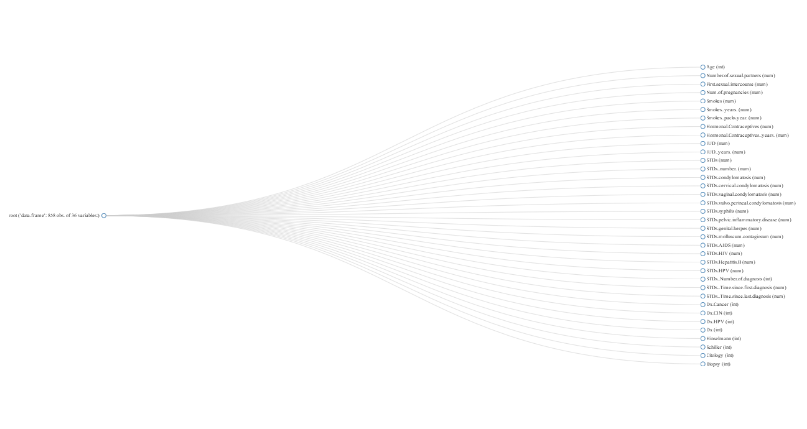

## mlr(Machine Learning in R) 패키지 설명
- https://www.rdocumentation.org/packages/mlr/versions/2.12.1
- machine-readable parameter descriptions을 포함해서 다수의 분류와 회귀 방법들과 인터페이스를 제공
- 생존분석, 군집 및 example-specific cost-sensitive learning(예제 관련 비용에 민감한 학습)을 위한 실험적인 확장됨. 
- cross-validation, bootstrapping and subsampling을 포함한 일반적인 resampling을 지원.
- 단일 및 다중 목표 문제에 대한 최신 최적화 기법을 사용한 하이퍼 매개 변수 튜닝 지원.
- 기능 선택을위한 필터 및 래퍼 메소드 지원.
- 기계 학습에서 공통적인 추가 작업으로 기본 학습자를 확장하고 쉽게 중첩된 재샘플링을 허용.
- 대부분의 작업을 병렬 처리
=> 한방 패키지.


## 데이터 설명
- UCI repository 에서 가지고 옴
- 858개의 Case와 36개의 변수
- 타켓변수 : Biopsy(생검), Citology(??), Schiller(??), Hinselmann(??)


```{r, warning = FALSE, message = FALSE}
# R 3.3.x 에서는 오류 R 3.5.0에서 실행시킴

#install.packages('gbm')  #  Generalized Boosted Regression Models
#install.packages('randomForestSRC') # Random Forests for Survival, Regression, and Classification
#install.packages('DataExplorer')
#install.packages('tidyverse')
#install.packages('mlr')
Sys.setlocale('LC_ALL','C')

Sys.getlocale()
setwd('D:/Work_Git/DeepMenia/part02/week1_180608')

library(DataExplorer)
library(tidyverse)
library(mlr)
df <- read.csv("kag_risk_factors_cervical_cancer.csv", header = T, sep =',', na.strings = '?')
```

## 데이터 탐색


```{r}
plot_str(df)
```



```{r}
plot_missing(df)
```


```{r, warning = FALSE, message = FALSE}
summary(df)
```


## 데이터 변환 및 준비

```{r, warning = FALSE, message = FALSE}
# changing variables into factor datatype
col <- c(5,8,10,12,14:25,29:36)
df1 <- df
df1[col] <- lapply(df1[col], factor)


# creating id variable for the instances
Id <- c(1:858)
df1 <- cbind(df1,Id)
df1 <- df1 %>%
  select(Id, everything()) 


head( df1$Biopsy )

# changing target variables into logical datatype(To work with multilabel classification)
df1$Biopsy <- as.logical(as.integer(as.character(df1$Biopsy)))
df1$Hinselmann <- as.logical(as.integer(as.character(df1$Hinselmann)))
df1$Schiller <- as.logical(as.integer(as.character(df1$Schiller)))
df1$Citology <- as.logical(as.integer(as.character(df1$Citology)))

head( df1$Biopsy )

# removing the variables with more than 90% of missing values
df1$STDs..Time.since.first.diagnosis <- NULL
df1$STDs..Time.since.last.diagnosis <- NULL

```

## 데이터 시각화

```{r, warning = FALSE, message = FALSE}
# ploting density distributtion of continous variables with target variables

df1mod <- df1 %>% gather(c(Age:Num.of.pregnancies,Smokes..years.,IUD..years.), key='Variables', value='values')

df1mod %>% ggplot(aes(x= values, fill= Biopsy,color = Biopsy)) + geom_density() + 
  facet_wrap(~Variables,ncol=3,scales="free")
```

```{r, warning = FALSE, message = FALSE}
df1mod %>% ggplot(aes(x= values, fill= Citology,color = Citology)) + geom_density() + 
  facet_wrap(~Variables,ncol=3,scales="free")
```


```{r, warning = FALSE, message = FALSE}
df1mod %>% ggplot(aes(x= values, fill= Schiller,color = Schiller)) + geom_density() + 
  facet_wrap(~Variables,ncol=3,scales="free")
```

```{r, warning = FALSE, message = FALSE}
df1mod %>% ggplot(aes(x= values, fill= Hinselmann,color = Hinselmann)) + geom_density() + 
  facet_wrap(~Variables,ncol=3,scales="free")
```

```{r, warning = FALSE, message = FALSE}
df1mod %>% ggplot(aes(x = Variables,y= values, fill= Biopsy,color = Biopsy)) + geom_point() + 
  facet_wrap(~Biopsy,ncol=3,scales="free") + geom_rug() + coord_flip()
```


```{r, warning = FALSE, message = FALSE}
df1mod %>% ggplot(aes(x = Variables,y= values, fill=Citology,color = Citology)) + geom_point() + 
  facet_wrap(~Biopsy,ncol=3,scales="free") + geom_rug() + coord_flip()
```

```{r, warning = FALSE, message = FALSE}
df1mod %>% ggplot(aes(x = Variables,y= values, fill= Schiller ,color = Schiller)) + geom_point() + 
  facet_wrap(~Biopsy,ncol=3,scales="free") + geom_rug() + coord_flip()
```

```{r, warning = FALSE, message = FALSE}
df1mod %>% ggplot(aes(x = Variables,y= values, fill= Hinselmann ,color = Hinselmann)) + geom_point() + 
  facet_wrap(~Biopsy,ncol=3,scales="free") + geom_rug() + coord_flip()
```


## 머신러닝하기 위한 데이터 전처리

```{r, warning = FALSE, message = FALSE}
# target variables are grouped together to form lables
label <- colnames(df1)[32:35]

label

# dataset parition for training and prediction
set.seed(1234)
index <- sample(nrow(df1), nrow(df1)*0.7)
train <- df1[index,]
test <- df1[-index,]
train.set <- row.names(train)%>%as.integer()
```

## 머신러닝 모델 적용

- mlr 라이브러리의 method을 사용해서 classification.

### Method 1 - randomforest SRC
```{r, warning = FALSE, message = FALSE}
traintask <- makeMultilabelTask(id ='multi', data = df1, target= label)
Rf.learner <- makeLearner('multilabel.randomForestSRC',predict.type = 'prob')

model1 <- mlr::train(Rf.learner,task = traintask, subset = train.set)
prediction1 <- predict(model1,newdata = test)
# hamloss is not that imperssive as well as other metrics - acc, auc
performance(prediction1)

getMultilabelBinaryPerformances(prediction1, measures = list(acc, mmce, auc))
```


####  random forest SRC의 hyper parameter tuning을 사용해서 예측
```{r, warning = FALSE, message = FALSE}
# checking through available parameters for hypertuning
getParamSet(Rf.learner)
```

```{r, warning = FALSE, message = FALSE}
# making resampling strategy
res <- makeResampleDesc('CV', iter = 3, stratify = F)
ream.learner <- resample(Rf.learner, task = traintask, resampling = res,show.info = T)
# random grid search
ctrl <- makeTuneControlRandom(maxit = 5L)
# parameter set definition
params <- makeParamSet(makeIntegerParam('ntree',upper=2000,lower=1200),makeIntegerParam('mtry', upper=8,lower=3))
# tuning the model
tuning <- tuneParams(learner= Rf.learner,task= traintask,par.set = params, resampling = res, control= ctrl,
                     measures=list(multilabel.subset01, multilabel.hamloss, multilabel.acc, 
                                   multilabel.f1, timepredict), show.info = T)
# taking the optimum parameters
tuning$x
```

```{r, warning = FALSE, message = FALSE}
# traing the model with selected parameter
learnerparset <- setHyperPars(learner = Rf.learner, par.vals = tuning$x)
mod.learner <- mlr::train(learner = learnerparset, task = traintask, subset = train.set)
modprediction <- predict(mod.learner, newdata= test)

# hamloss is significantly reduced and acc & auc has increased
performance(modprediction,measures = list(multilabel.subset01, multilabel.hamloss, multilabel.acc, multilabel.f1))
```


```{r, warning = FALSE, message = FALSE}
getMultilabelBinaryPerformances(modprediction, measures = list(acc, mmce, auc))
```


## Method 2 - Problem transformation method
## Binary relevance method

```{r, warning = FALSE, message = FALSE}
# creating basic learner and wraping the learner with multilabel probel transformation procedures
basic.learner <- makeLearner('classif.gbm', predict.type ='prob',fix.factors.prediction=TRUE)

binrelv.learner <- makeMultilabelBinaryRelevanceWrapper(basic.learner)
model2 <- mlr::train(binrelv.learner, task =  traintask, subset = train.set)
```

```{r, warning = FALSE, message = FALSE}
prediction2 <- predict(model2,newdata = test)
performance(prediction2,measures = list(multilabel.subset01, multilabel.hamloss, multilabel.acc, multilabel.f1))
```

```{r, warning = FALSE, message = FALSE}
getMultilabelBinaryPerformances(prediction2, measures = list(acc, mmce, auc))
```


## Method 3 - Classifier chains method

```{r, warning = FALSE, message = FALSE}
classchain.learner <- makeMultilabelClassifierChainsWrapper(basic.learner)
model3 <- mlr::train(classchain.learner, task =  traintask, subset = train.set)
```

```{r, warning = FALSE, message = FALSE}
prediction3 <- predict(model3,newdata = test)
performance(prediction3,measures = list(multilabel.subset01, multilabel.hamloss, multilabel.acc, multilabel.f1))
```

```{r, warning = FALSE, message = FALSE}
getMultilabelBinaryPerformances(prediction3, measures = list(acc, mmce, auc))
```

## Method 4 - Dependent binary relevance method

```{r, warning = FALSE, message = FALSE}
depbin.learner <- makeMultilabelDBRWrapper(basic.learner)
model4 <- mlr::train(depbin.learner, task =  traintask, subset = train.set)
```

```{r, warning = FALSE, message = FALSE}
prediction4 <- predict(model4,newdata = test)
performance(prediction4,measures = list(multilabel.subset01, multilabel.hamloss, multilabel.acc, multilabel.f1))
```

```{r, warning = FALSE, message = FALSE}
getMultilabelBinaryPerformances(prediction4, measures = list(acc, mmce, auc))
```


## Method 5 - stacking
```{r, warning = FALSE, message = FALSE}
stack.learner <- makeMultilabelStackingWrapper(basic.learner)
model5 <- mlr::train(stack.learner, task =  traintask, subset = train.set)
```

```{r, warning = FALSE, message = FALSE}
prediction5 <- predict(model5,newdata = test)
performance(prediction5,measures = list(multilabel.subset01, multilabel.hamloss, multilabel.acc, multilabel.f1))
```

```{r, warning = FALSE, message = FALSE}
getMultilabelBinaryPerformances(prediction5, measures = list(acc, mmce, auc))
```

## Method 6 - Nested Stacking

```{r, warning = FALSE, message = FALSE}
nest.learner <- makeMultilabelNestedStackingWrapper(basic.learner)
model6 <- mlr::train(nest.learner, task =  traintask, subset = train.set)
```

```{r, warning = FALSE, message = FALSE}
prediction6 <- predict(model6,newdata = test)
performance(prediction6,measures = list(multilabel.subset01, multilabel.hamloss, multilabel.acc, multilabel.f1))
```

```{r, warning = FALSE, message = FALSE}
getMultilabelBinaryPerformances(prediction6, measures = list(acc, mmce, auc))
```


## 결과
- problem transformation models와 hypertuned multilabel random forest 본질적으로 거의 비슷하다.
- 종속변수의 가정은 도메인 지식을 활용해서 악용될 수 있다.
- 종속변수 순서는 타켓변수 다음에 오는 종속변수 순서와 똑같이 중요한다.


