# Cloudera Data Science Workbench(CDSW) 1.4.x 설치


- 참고 : https://www.cloudera.com/documentation/data-science-workbench/latest/topics/cdsw_install.html
- CentOS7 기준으로 준비함

## 설치방법
  - Using a Custom Service Descriptor (CSD) and Parcel : 이방법 기준
  - Using a Package 
  
## 설치전에 준비 사항들

### Cloudera Manager and CDH 요구
 - Cloudera Manager가 설치된 환경을 요구 
 - Cloudera Manager 5.13 or higher 5.x versions.


### 지원 운영체제 확인
 - RHEL / CentOS / Oracle Linux RHCK : 7.2, 7.3, 7.4
 - Oracle Linux (UEK - default) : 7.3
 - SUSE Linux Enterprise Server (SLES) : 12 SP2, 12 SP3
 
### JDK Requirements
 - Cloudera Manager에서 설치한 버전과 동일한 JDK1.8.x
 
### 하드웨어 구성
 - CPU: 16+ CPU (vCPU) cores
 - RAM: 32+ GB RAM
 - Disk
     - Root Volume: 100+ GB.
     - Application Block Device or Mount Point (Master Host Only): 1 TB
         - CDSW MASTER서버만 필요
         - 따로 설정하지 않으면  Root Vlume을 사용함.    
         - /var/lib/cdsw     
     - Docker Image Block Device: 1 TB
         - * 파티션 설정이 되어 있지 않는 별도의 Disk *
         - Do not mount these block devices prior to installation.
         - 파티션 설정된 Disk 사용하면, 하둡 클러스터의 OS까지 밀고 다시 설치하는 경우도 있으니 주의하자.      
         
### Supported Browsers
  - Chrome (latest stable version) : 추천
  - Internet Explorer (IE) 11+ : 안된다고 보면 됨.
  
### DNS 도메인명 등록  ***필수***
  - cdsw.<your_domain>.com.    cdsw서버의 아이피 
  - *.cdsw.<your_domain>.com  cdsw서버의 아이피
      - DNS 등록 안 하고 설치까지는 되는데 CDSW WebUI에서 docker 컨테이너를 못 찾는 문제가 생김.
  - 하둡클러스터를 구성하는 서버들도 DNS에 등록
      - 안 하면 pyspark 돌릴때 work node명을 찾을수 없다고 에러 발생함.
  - Windowns2012서버의 DNS가 가장 쉬움 
  
### Apache Spark 2 설치
  - 참고 : https://www.cloudera.com/documentation/spark2/latest/topics/spark2_installing.html
  - CDSW도 같이 작업이 있어서 여기서 같이 설명함.
  - wget -P  /opt/cloudera/csd   http://archive.cloudera.com/spark2/csd/SPARK2_ON_YARN-2.3.0.cloudera2.jar
  - wget -P  /opt/cloudera/csd   https://archive.cloudera.com/cdsw1/1.4.0/csd/CLOUDERA_DATA_SCIENCE_WORKBENCH-CDH5-1.4.0.jar
  - chown cloudera-scm:cloudera-scm  /opt/cloudera/csd/*.jar && chmod 644 /opt/cloudera/csd/*.jar 
  - service cloudera-scm-server restart  # 클라우데라 매니저 서버를 재시작
  - Cloudera Management Service 재시작
  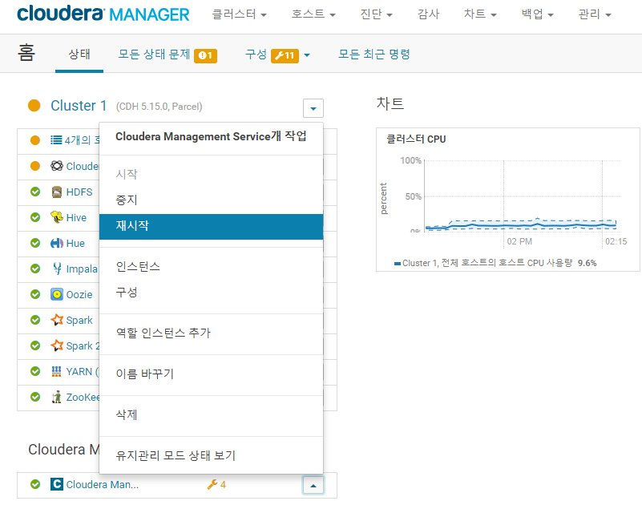
  - Spark2 배포용 Parcels 등록 화면
  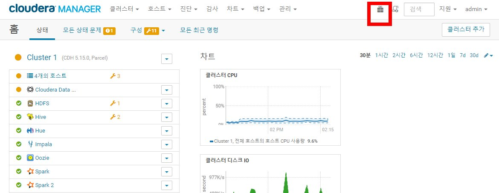
  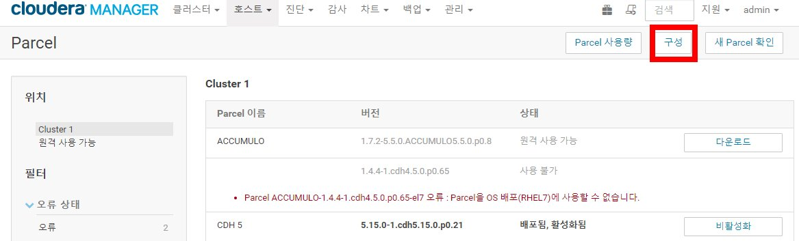
  - Spark2 배포 저장소 URL을 등록하고 변경내용 저장 버튼을 클릭
  - CDSW도 같이 작업이 필요하므로 같이 등록하자
  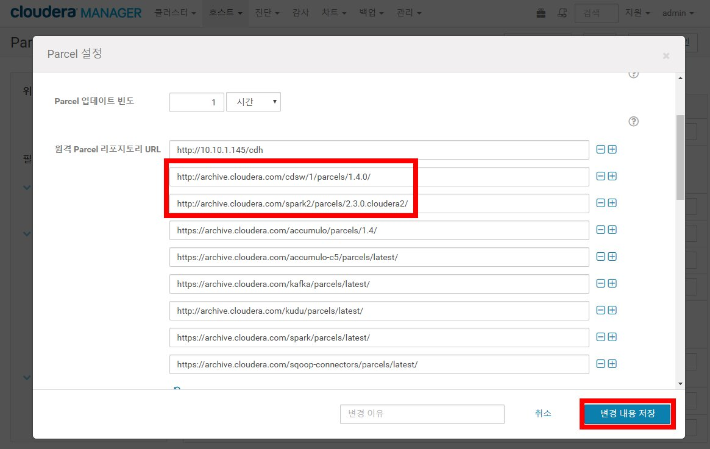
  - 아래 그림과 같이 되도록 다운로드 -> 배포 -> 활성화 
  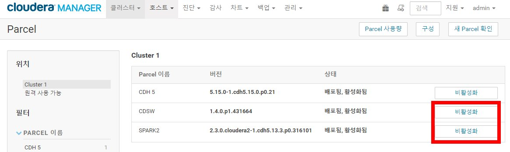
  - Spark2 서비스 추가
  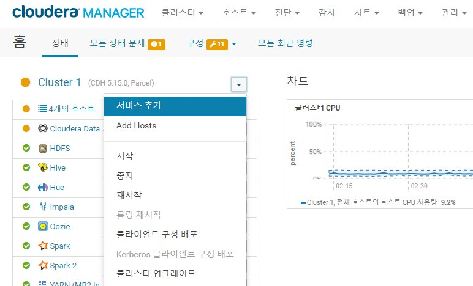
  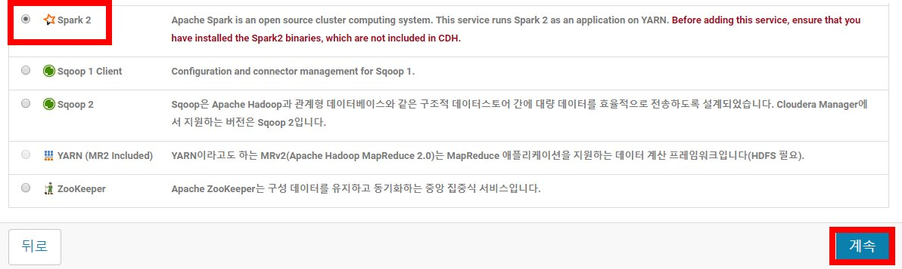
  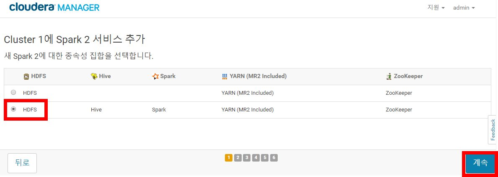
  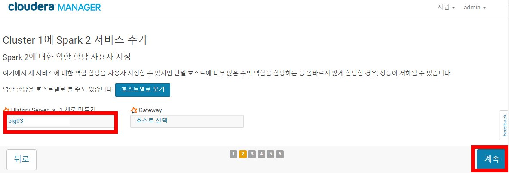
  - Spark2 서비스 완료 화면
  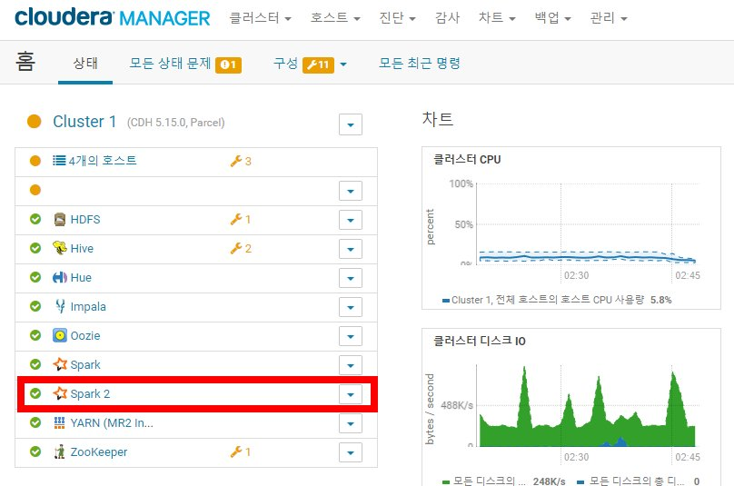
   

## Download and Install the Cloudera Data Science Workbench CSD

### Install the Cloudera Data Science Workbench Parcel
  - Spark2 설치할때 CDSW도 같이 함.
  - Parcel Repository URL : https://archive.cloudera.com/cdsw1/1.4.0/parcels/
  

### Cloudera Data Science Workbench용 호스트 추가
- CDSW용 신규로 호스트를 추가할때는 아래 과정이 필요, 이미 클러스터에 등록된 호스트알때는 이 과정이 필요없음.
- NTP 동기화
```
yum install -y ntp
```

- file descriptor 수정
```
cat <<EOT >>   /etc/security/limits.conf
*    hard nofile 131072
*    soft nofile 131072
root hard nofile 131072
root soft nofile 131072
EOT
```
- JDK 1.8.x설치 : 클러스터에 설치된 버전과 동일하게
- 호스트 추가
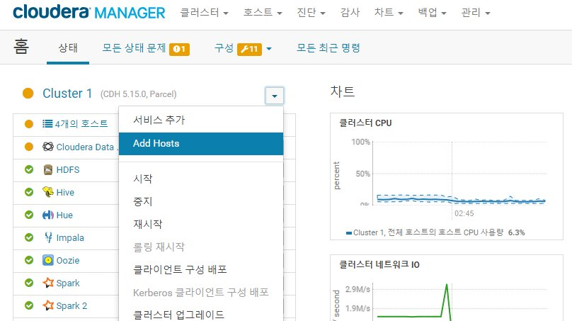
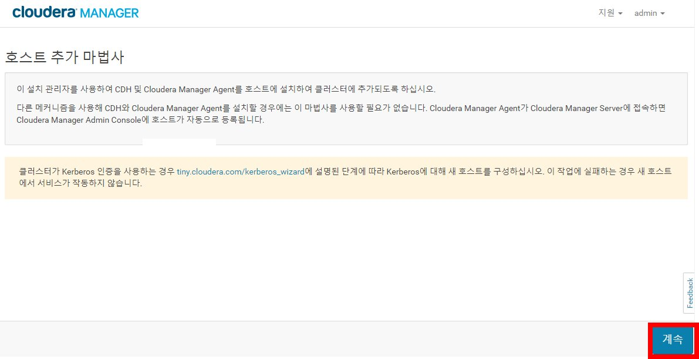
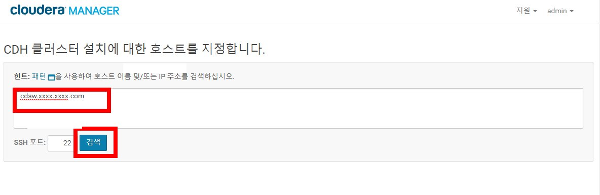
- 검색된 호스트를 체크하고 계속버튼 클릭
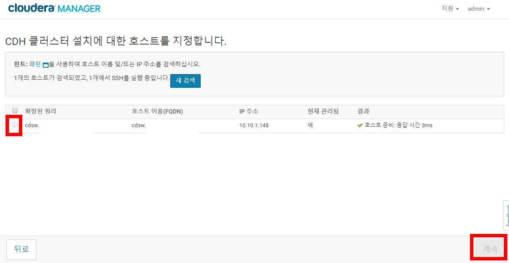
- 나머지 단계는 계속버튼 클릭으로 대부분 처리됨 , 추가 장비가 없어서 화면캡쳐를 못함.
- 호스트가 추가된 화면
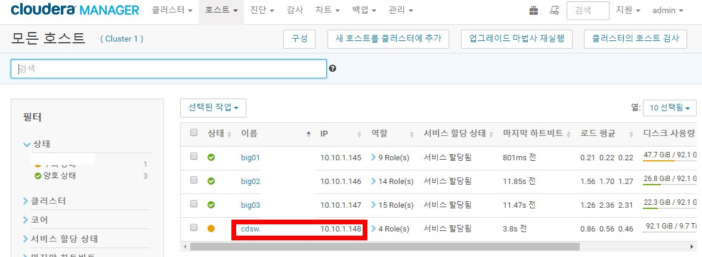
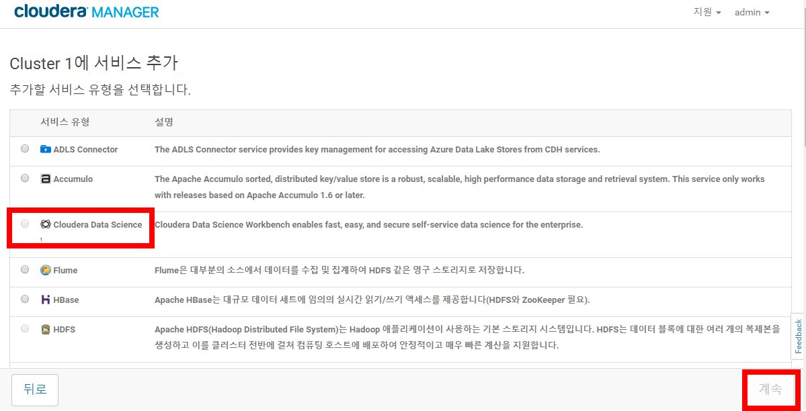
- 이미 CDSW설치된 Cloudera Manager에서는 다시 설치가 되지 않으므로 설치 과정 화면을 캡처 못함.
- 나중에 CDSW의 무료 License 기간이 끝나서 다시 설치할때 설치과정을 캡처하는 것으로 하고...   
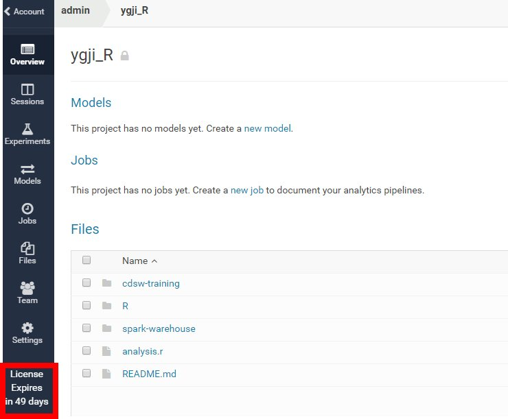  
- 설치 과정중에 중요한 설정값들
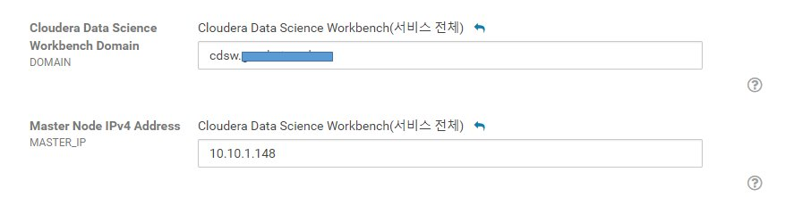
- Docker Block Device에서 사용할 disk를 지정 : 새로 disk를 구입한 상태
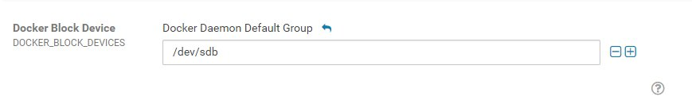
- 설치 과정을 설정값들만 정확히 입력하면 계속 버튼만 클릭하면 설치됨
- 모두 설치후 CDSW가 정상 실행까지 10 ~ 20분정도 걸림
- CDSW를 정상 실행했을때 docker container 개수
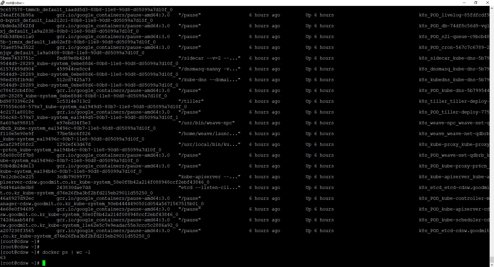
- CDSW 초기 접속화면으로 "Sign Up for a New Account" 을 클릭해서 계정을 추가후에 로그인하면 됨.
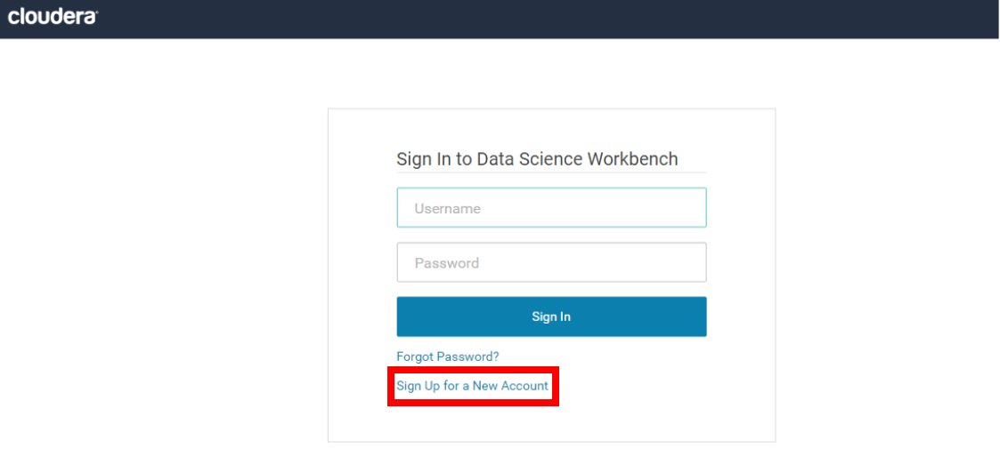 
- 기타 사용법은 공식 문서로 대체함
- https://www.cloudera.com/documentation/data-science-workbench/latest/topics/cdsw_quickstart.html


### Cloudera Data Science Workbench 서비스 추가
  - 서비스 추가 
  
  - CDSW 선택
  

  